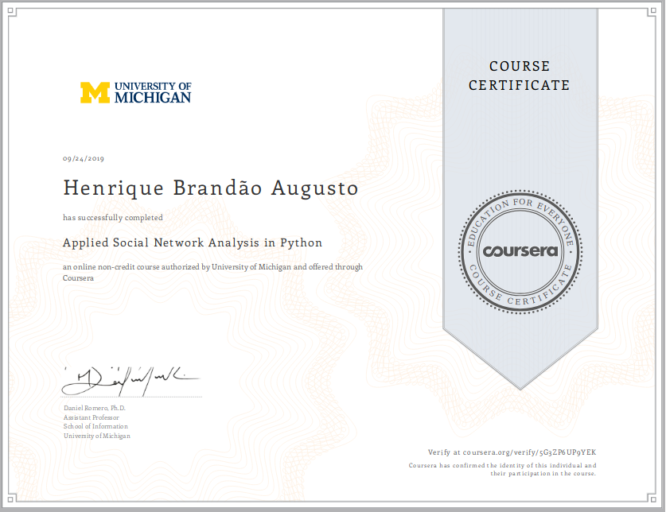

# [Applied Social Network Analysis in Python](https://www.coursera.org/learn/python-social-network-analysis?) @ Coursera

#### *This course is part of the Applied Data Science with Python [Specialization](https://www.coursera.org/specializations/data-science-python)*

### Feel free to read. I hope it helps you on YOUR OWN work.

### Despite the MIT License, remember Coursera's [Honor Code](https://learner.coursera.help/hc/en-us/articles/209818863-Coursera-Honor-Code) and [Code of Conduct](https://learner.coursera.help/hc/en-us/articles/208280036-Coursera-Code-of-Conduct)!

## Content

- Week 1: Why Study Networks and Basics on NetworkX
- Week 2: Network Connectivity
- Week 3: Influence Measures and Network Centralization
- Week 4: Network Evolution

## Bonus readings
- [NetworkX Documentation](https://networkx.github.io/documentation/stable/)
- [A Data Science Framework: To Achieve 99% Accuracy](https://www.kaggle.com/ldfreeman3/a-data-science-framework-to-achieve-99-accuracy)
- [A Kaggler's Guide to Model Stacking in Practice](http://blog.kaggle.com/2016/12/27/a-kagglers-guide-to-model-stacking-in-practice/?source=post_page---------------------------)
- [Knowledge Graphs are the new Black](https://medium.com/hackernoon/knowledge-graphs-are-the-new-black-the-year-of-the-graph-newsletter-may-2019-6f5ce994d821) @ Hacker Noon
- [Power Law](https://www.statisticshowto.datasciencecentral.com/power-law/)
- 

##### Enjoy! &#8718;

